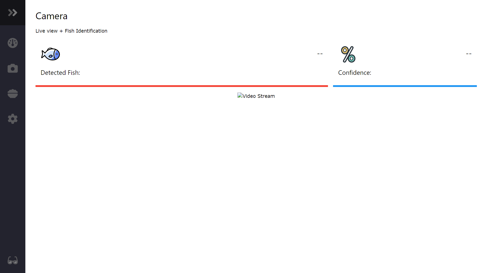

# AquaPi

Monitor your Aquarium's Temperature and Water Level. With DFRobot Circuit Boards and Probe upgrades, you can also monitor your pH, Dissolved Oxygen, Temperature, Turbidity and other DFRobot circuits and probes. It can also identify types of fish to set conditions of the environment to the selected type of fish.
Powered by an Raspberry Pi and Controlled by IoT. You can set alerts for anything, make automations for auto-top-off, and see beautiful graphs of your aquarium's data (see screenshot).

## Appearance

This app simply made during my college as a final output for Project and Design 2. The UI is fully responsive therefore viewing it on small screens should be fine.

## Features

- Monitoring System [Local and Online]
- Feeding System [Schedule and Manual]
- AI System [Fish Identification]
- Water Parameter Sensors
- Database [SQLite]

## Software

Visual Studio Code, Python, HTML, CSS, JavaScript and TensorFlow.

## Installation

### 1. Checkout this repository from git

    git clone https://github.com/immafishball/AquaPi AquaPi-git

### 2. Make sure a Python version greater than or equal to 2.6 is installed

Most Linux distributions come with Python already installed, if not see [the Python documentation](http://docs.python.org/2.7/using/index.html) for instructions on how to install Python.

### 3. Install the system requirements

    TBA

## Notice

This project can be run fully locally without any internet connection, otherwise you will need to have a connection to control the IoT devices.
